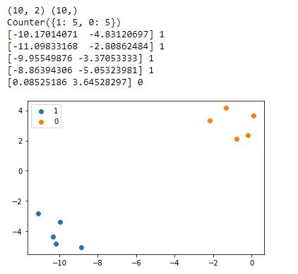

# BINARY CLASSIFICATION
## Aim:
To write a python program to perform binary classification.

## Equipments Required:
1. Hardware – PCs
2. Anaconda – Python 3.7 Installation / Moodle-Code Runner /Google Colab

## Related theoritical concepts
Binary classification is a form of classification — the process of predicting categorical variables — where the output is restricted to two classes. It is used in many different data science applications, such as Medical Diagnosis, Email analysis, Marketing, etc. For example, in medical diagnosis, a binary classifier for a specific disease could take in symptoms of a patient and predict whether the patient is healthy or has a disease. The possible outcomes of the diagnosis are positive and negative.


## Algorithm
1.define dataset
2.summarize dataset shape
3.summarize observations by class label
4.summarize first few examples
5.plot the dataset and color the by class label

## Program:
```
/*
Program to implement binary classification.
Developed by: Gowri M
RegisterNumber: 212220230019
*/
```
```python
from numpy import where
from collections import Counter
from sklearn.datasets import make_blobs
from matplotlib import pyplot

X,y = make_blobs(n_samples=10,centers=2,random_state=1)
print(X.shape,y.shape)
counter=Counter(y)
print(counter)

for i in range(5):
    print(X[i],y[i])
    
for label, _ in counter.items():
    row_ix=where(y==label)[0]
    pyplot.scatter(X[row_ix,0], X[row_ix,1], label=str(label))
pyplot.legend()
pyplot.show()
```

## Output:
)


## Result:
Thus the python program performed binary classification successfully.
